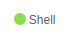
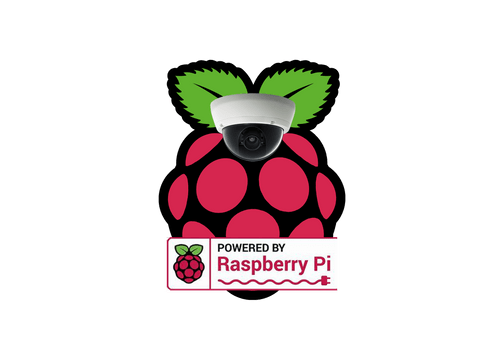

Notice: This is the old index page for github.io this is no longer used.

# oxmc.github.io
oxmc's website

--------------

Current projects:
lptpsettings 

Type of code: 

link to lptpsettings <a class="github-button" href="https://github.com/oxmc/lptpsettings" data-icon="images/logo.jpg" aria-label="link">Click me!</a>

Raspisecurity 

Type of code: ,

link to Raspisecurity <a class="github-button" href="https://github.com/oxmc/raspisecurity" data-icon="images/logo.jpg" aria-label="link">Click me!</a>

-------------

Finished projects:
none

-------------
Hosting:

I will host a free page on my website titled "oxmc.github.io/users/YourGithubname/Yourprojectname/"

I will also host a php, mysql, and 5GB storage server, for free.

If you would like to apply please file a request and title it "website hosting"
then put the files you want me to host, also if you want more than 5GB of storage then add "morestoragerequired" then the amount at the end of the request form.

-------------

# Notouchsign or NTS

repository: <a class="github-button" href="https://github.com/oxmc/notouchsign" >here</a>

Made for: Gays Towing inc. in burbank california

-------------
